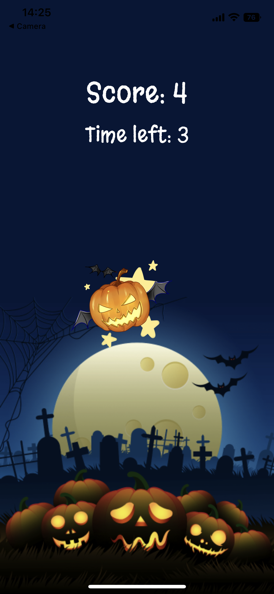

# Smash the Pumpkin

A game made for a [Make it an App]() YouTube channel for educational purposes.



# Requirements

## Node.js

Install the [LTS Node.js](https://nodejs.org/en/download/) version for your operating system

## Git

Check in the terminal if you have the installed version of the git.

```
git --version
```

If you will see something like `command not found: git`
then install git from [here](https://git-scm.com/downloads)

## VS Code

Download VS Code from [here](https://code.visualstudio.com/)

## Expo Go

Install Expo Go from [here](https://expo.dev/client) app using your mobile device

# Development

1. Install modules and start the dev server

```
npm install
npm run start
```

2. Make sure your mobile device is connected to the same Wi-Fi network as your computer.

3. Scan the QR code displayed in the terminal

# Design

[Figma mock-ups](https://www.figma.com/file/z2NmJqjVZsnkdexkvOdzzx/Make-It-an-App?node-id=101%3A3)

# License

[MIT](./LICENSE.md)
